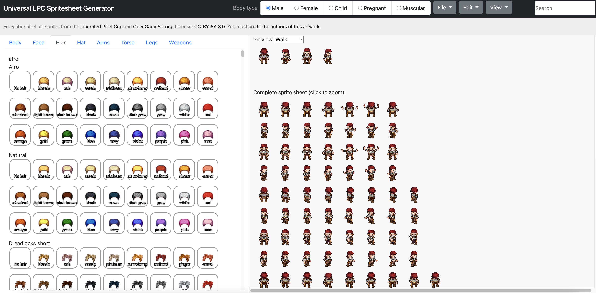

Universal LPC Spritesheet Character Generator with better UI
=============================================

Forked from https://github.com/sanderfrenken/Universal-LPC-spritesheet.

The original Universal LPC Spritesheet Character Generator was difficult to use,
switching between body parts or body addons was tidious. While it has previews of each item,
all items are arranged using tree nodes, switching parts often means scroll, expand, select, 
making the character creation a very long process.

The new improved UI aims to remove the clutter, provide better visuals, more choices on screen
allowing quicker character creation.

